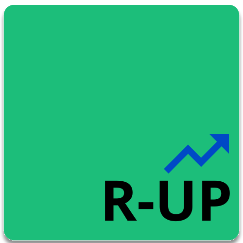

# Rucula Up

Rucula Up, esse é um projeto que tem como objetivo principal o gerenciamento de individuos e béns materiais presente em uma instituição qualquer.


<p align="center">

</p>

Para reduzir o desenvolvimento repetitivo, Rucula Up utiliza [RuculaX](https://www.nuget.org/packages?q=RuculaX) e [rucula-js](https://www.npmjs.com/package/@reginaldo-marinho/rucula-js) 

# Atenção 
Para que o fluxo de desenvolvimento seja o mais flexivel possível, antes de mais nada, tudo que é relacionado a infraestrutura do projeto deve estar em perfeito funcionamento, assim, não haverá disperdicio de tempo com instalações, testes manuais, etc.

> Até este ponto foquei nas bibliotecas que criei para constatar seu funcionamento, agora cheguei em um ponto onde devo ir para a infraestrutura.

## Sobre o Desenvolvimento
- Este projeto deve ser usado com boas práticas de desenvolvimento de software
- Crar formas de facilitar a manutenção e a entrega
- Criar padrões de modo que facilite o gerenciamento do projeto
- Documentar principalmente  a parte arquitetural e configurações do projeto


## Multi Tenancy
## Tecnologias

|  | |  |
|-------------------------------------------|-------------------------------------------|-------------------------------------------|


- Angular
- Docker
    - Docker Compose
    - Docker Engine
- Entity Framework e Dapper
- Postgres Sql


## Trabalhando com o Projeto

Para que haja regras e padrões, procure usar a CLI **ruculaUp.Administration.Console**, com ela você poderá gerenciar a interface `ui`, o backend `app` e fazer backup do banco de dados da aplicação sem muito trabalho.

Para operações mais complexas, utilize da sua expertize.


<pre>
 _ __ _   _  ___ _   _| | __ _   _   _ _ __  
| '__| | | |/ __| | | | |/ _` | | | | | '_ \ 
| |  | |_| | (__| |_| | | (_| | | |_| | |_) |
|_|   \__,_|\___|\__,_|_|\__,_|  \__,_| .__/ 
                                      |_|  

Welcome to rucula-up cli
Please, enter a command or enter a --help for a list of available commands. 

Projects Name:
  proj_test_development Projeto de teste
  rucula-up-production 

usage: [ProjectName] [CommandName]

  ui-image-create     Create new Image
  ui-run              Create new Container
  ui-stop             Stop Container
  ui-start            Start Container
  ui-inspect          Inspect Container

  app-up        compose up Containers
  app-up-build  compose up Containers and force build images
  app-down      compose down Containers
  app-start     compose start container(s)
  app-rm        compose remove container(s)
  app-rm-all    compose remove container(s), volumes and networks
  app-stop      compose stop container(s)
  app-db-exec compose exec iterative mode container
  app-db-backup compose container(database) backup

</pre>

### Beneficios CLI
  - **app-up**: Faz uso do último backup ao criar iniciar o container 
  - **app-rm**: Faz backup instantaneo.
## Configurações de Pastas


## Instalação

## Requisitos
  - [ ] Docker
  - [ ] Docker compose
  - [ ] Tool Entity Framework Core

## Arquivos de Configurações

- File Docker Compose
  - [ ]  service **ruculaup_**
    - environment
      - [ ] ENVIRONMENT_CONTAINER
    - volumes
      - [ ] mount
        - [ ] source: Informe o caminho da pasta que contém as janelas  
        - [ ] target: Informe o caminho da pasta que contém as janelas  
        - Exemplo
          ```yml
              volumes:
              - type: bind
                source: /home/reginaldo-marinho/rucula-up/UI/window
                target: /home/reginaldo-marinho/rucula-up/UI/window
                read_only: true
          ```